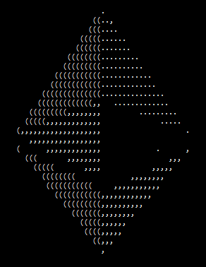

## Learning Solidity Misc 
#### A collection of code snippets to document my learning in solidity language.
----------------------------------------------------------------------------
----------------------------------------------------------------------------

 

<pre>
     _______.  ______    __       __   _______   __  .___________.____    ____ 
    /       | /  __  \  |  |     |  | |       \ |  | |           |\   \  /   / 
   |   (----`|  |  |  | |  |     |  | |  .--.  ||  | `---|  |----` \   \/   /  
    \   \    |  |  |  | |  |     |  | |  |  |  ||  |     |  |       \_    _/   
.----)   |   |  `--'  | |  `----.|  | |  '--'  ||  |     |  |         |  |     
|_______/     \______/  |_______||__| |_______/ |__|     |__|         |__|     
                                                                               
</pre>

## Code Snippets List

* [d] [ERC165-standard](https://github.com/bananlabs/learning_solidity_misc/tree/main/ERC165-standard)
* [f] [ping.sol](https://github.com/bananlabs/learning_solidity_misc/blob/main/ping.sol)
* [f] [rand-name.sol](https://github.com/bananlabs/learning_solidity_misc/blob/main/rand-name.sol)
* [f] [rand-name-v2.sol](https://github.com/bananlabs/learning_solidity_misc/blob/main/rand-name-v2.sol)
* [d] [selectors-signatures](https://github.com/bananlabs/learning_solidity_misc/tree/main/selectors-signatures)
* [f] [OverUnderFlow.sol](https://github.com/bananlabs/learning_solidity_misc/blob/main/OverUnderFlow.sol)
-----------------------------------------------------------------------------
'd' is for directory.   'f' is for file.  
note: use [Remix IDE](https://remix.ethereum.org/) to run the code. 

-----------------------------------------------------------------------------

  🦍 [@bananlabs](https://twitter.com/bananlabs) :banana:

-----------------------------------------------------------------------------
                                                                                                                                                                                                                            
